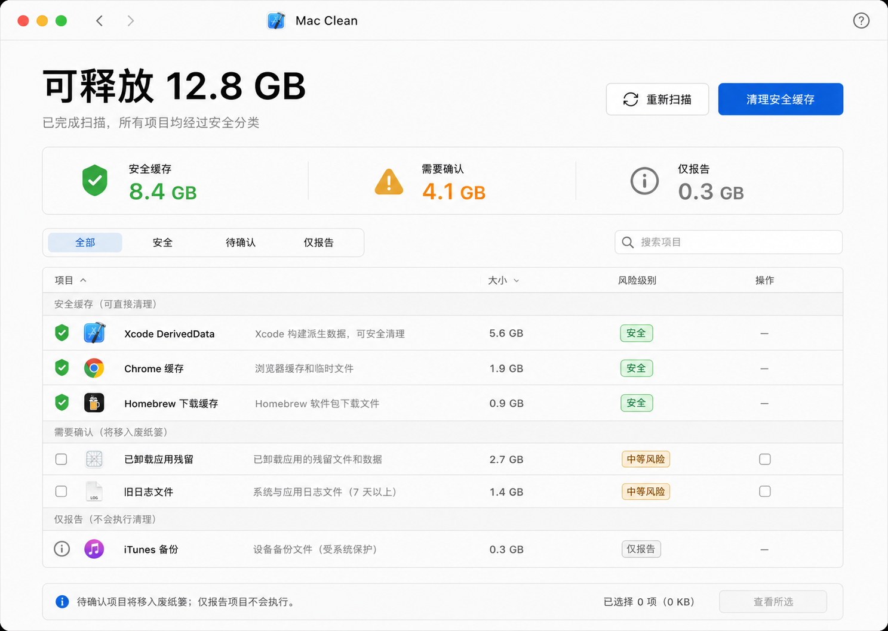
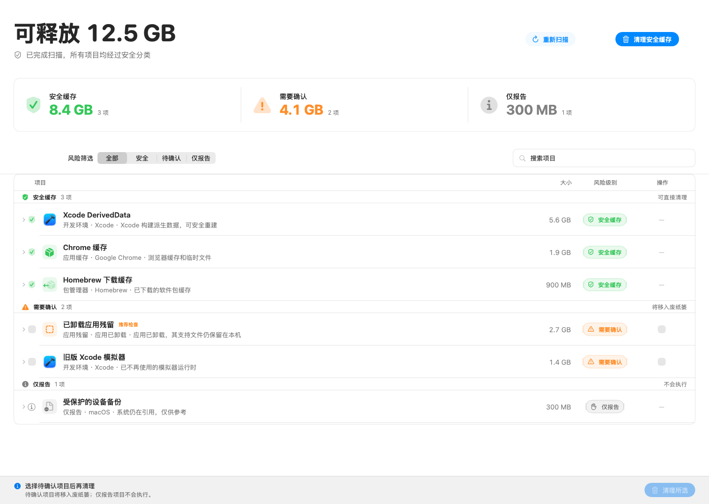

# 🧹 Mac Clean

> 原生 macOS 菜单栏清理工具 —— 只清理可再生数据，安全优先。

Mac Clean 是一个面向 **macOS 14+** 的菜单栏应用，帮助你在不承担风险的前提下回收磁盘空间。它扫描当前用户的应用缓存、日志与开发数据，只把**可再生、可安全重建**的项目列为绿色可清理项，其余一律只报告或标记为"待确认"，绝不擅自删除。

当前仓库是可构建、可运行的 **Foundation MVP**，全部代码原生 Swift，无网络依赖，扫描数据只保存在本机。

<p align="center">
  
</p>

<p align="center">
  
</p>

## ✨ 功能特性

- **菜单栏常驻**：左键点击打开面板，右键（或 Control-点击）弹出菜单；无 Dock 图标，单实例运行，重复启动只会激活已有实例。
- **应用清单驱动**：从 `/Applications`、`/System/Applications`、`~/Applications` 建立已安装应用清单，并读取当前正在运行的应用。
- **四个安全扫描器**：
  - **应用缓存**：`~/Library/Caches` 中与已安装且未运行应用匹配的可再生缓存 → 绿色
  - **系统数据**：`~/Library/Logs` 中与已安装应用同名的旧日志目录、`DiagnosticReports` 崩溃报告 → 绿色
  - **开发数据**：`~/Library/Developer/Xcode/DerivedData` 构建产物（Xcode 未运行时）→ 绿色
  - **应用支持**：`~/Library/Application Support` 中已卸载应用的残留数据 → 黄色"待确认"
- **风险分级**：绿色（可安全清理）、黄色（待确认，需手动勾选）、红色（只报告）。系统容器（`com.apple.*`）、正在运行应用的缓存**永不推荐清理**。
- **安全清理**：清理前重新核对应用清单，候选应用已启动则跳过；所有清理移入**废纸篓**而非直接删除。
- **Finder 定位**：每个候选项可根据当前文件状态在 Finder 中定位。
- **本地审计**：扫描时间戳与逐项清理结果通过 SwiftData 保存在本机，不联网、不上传任何数据。
- **每周补扫**：菜单栏面板出现时自动补做错过的每周扫描，自动流程只执行绿色项，任何扫描器失败都会安全地保留失败状态、不清理、不通知。

## 📋 系统要求

- macOS 14 (Sonoma) 或更高版本
- Apple Silicon（arm64）—— 当前发布产物仅包含 arm64 架构

## 💾 安装

### 方式一：DMG 安装包（推荐）

从 [Releases](https://github.com/cirelir/Mac-clean/releases) 下载最新的 `MacClean-x.y.z.dmg`，双击打开，把 **Mac Clean** 拖入 **Applications** 文件夹即可。

> ⚠️ **当前状态说明**：现有 DMG 为 **ad-hoc 签名、未公证**。从浏览器下载会触发 macOS 的"无法验证开发者"提示，需要在"系统设置 → 隐私与安全性"中点击"仍要打开"。正式分发需要 Developer ID 签名 + 公证（见[路线图](#-路线图)）。**仅 arm64**，Intel Mac 暂不支持。

### 方式二：从源码构建

需要 Xcode 26.4+ 与 Swift 6.3（macOS 14+）。

```sh
git clone https://github.com/cirelir/Mac-clean.git
cd Mac-clean

# 构建
swift build -c release --product MacCleanApp

# 运行（启动菜单栏界面）
swift run MacCleanApp

# 运行测试
swift test
```

### 打包 DMG（维护者）

```sh
swift build -c release --product MacCleanApp
# 组装 MacClean.app（Info.plist / PkgInfo / AppIcon.icns），然后：
codesign --force --deep --sign - MacClean.app
hdiutil create -volname "Mac Clean" -srcfolder <staging> -ov -format UDZO MacClean-x.y.z.dmg
```

## 🚀 使用说明

1. 启动后菜单栏出现 Mac Clean 图标（外部驱动器 + 对勾）。
2. **左键点击**图标打开扫描面板 → 点击"扫描"。
3. 面板按风险分组展示候选项：绿色可直接"清理安全缓存"；黄色"待确认"项在**详情页**勾选后随"清理所选"一并移入废纸篓。
4. 每个候选展示原始/规范化路径、扫描器、规则、所有者、风险原因与计划动作；文件仍存在时可"在 Finder 中显示"。
5. **右键**（或 Control-点击）图标 → "退出 Mac Clean"。

## 🛡️ 安全模型

设计的核心原则：**只清理可再生数据，绝不猜测、绝不直接删除**。

- 扫描范围固定为当前用户的 `~/Library/Caches`、`~/Library/Logs`、`~/Library/Application Support`、`~/Library/Developer` 的直接子项；**不扫描**用户文档、下载、照片、音乐、项目目录与包管理器依赖目录。
- 允许根在启动时规范化并固定为不可变 canonical URL；配置路径最后一个组件必须是真实目录（不能是符号链接/别名）；根被替换时 fail closed。
- 候选路径以组件级判断验证归属，解析后的符号链接越界即被拒绝；执行器使用 `O_NOFOLLOW` 与 descriptor-relative `openat` 遍历，防目录替换竞态。
- 绿色候选必须**明确匹配到已安装且未运行的 Bundle ID**；唯一的无主绿色例外是崩溃报告（纯诊断产物）。
- 清理动作只允许**清空已验证候选目录的内容并保留根目录**；所有删除移入废纸篓。
- 清理前重新读取运行应用清单；清单读取失败则整次 fail closed。

完整边界、信任规则、竞态限制与当前不具备的权限，见 [docs/security-model.md](docs/security-model.md)。

## 🗂️ 项目结构

```
Sources/
├── CleanCore/        # 核心逻辑（与 UI 无关，可独立测试）
│   ├── Models/       # CleanupCandidate / ApplicationInventory
│   ├── Scanning/     # 四个扫描器 + ScanCoordinator + 应用清单
│   ├── Cleanup/      # CleanupPlanner / CleanupExecutor / 描述符树清理
│   ├── Risk/         # RiskClassifier 风险分级
│   ├── Paths/        # SafePathValidator / FileFingerprinting
│   └── Audit/        # AuditRecord 审计记录
├── MacCleanUI/       # SwiftUI 菜单栏面板、详情窗口、调度与持久化
│   ├── Views/        # MenuBarRootView / DetailView / CandidateRow
│   ├── App/          # AppModel / AppearanceStore / 依赖注入
│   ├── Scheduling/   # WeeklyScanScheduler / NotificationService
│   ├── Persistence/  # SwiftDataAuditStore
│   └── Finder/       # FinderRevealer
└── MacCleanApp/      # 应用入口、单实例、状态栏控制器
Tests/
├── CleanCoreTests/   # 扫描器、风险、路径、清理的单元测试
└── MacCleanUITests/  # 视图模型、调度、审计存储的测试
docs/
├── security-model.md # 安全模型完整说明
└── design/           # 界面设计稿与对比图
```

架构上分为 **CleanCore（纯逻辑）** 与 **MacCleanUI（界面）** 两个 target，核心安全逻辑不依赖 UI，可独立测试与审计。

## 🧪 测试

```sh
swift test
```

测试覆盖：各扫描器的匹配与排除规则、路径验证器、风险分级、清理计划与执行器、应用清单、Finder 定位、SwiftData 审计存储、每周补扫调度与视图呈现。

## 🗺️ 路线图

1. **Foundation MVP（当前）**：应用清单、缓存扫描、风险分级、安全清理、Finder 定位、本地审计、每周补扫与紧凑菜单栏/详情界面。
2. **扩展扫描器**：Homebrew、npm、pip、Cargo、Xcode DerivedData 与不可用模拟器。依赖候选必须来自包管理器的**权威结果**，不按最后访问时间猜测"未使用"依赖。
3. **可分发产品**：正式 Xcode `.app` 工程、Full Disk Access 引导、登录项与受限 XPC Helper；随后完成通用归档、Hardened Runtime、Developer ID 签名、公证、staple 与 `.dmg` 制作。

## 🤝 贡献

欢迎提交 Issue 与 PR：

- 新扫描器请先说明权威数据来源与安全边界，评审会重点关注误删风险。
- 保持 Swift 6 严格并发模式（`swiftLanguageModes: [.v6]`），核心逻辑放 `CleanCore` 并补测试。
- 修改安全相关逻辑（路径验证、清理执行）前，请先阅读 [docs/security-model.md](docs/security-model.md)。

## 📄 许可证

> **待定**：本仓库尚未选择开源许可证。在添加 LICENSE 文件之前，代码默认保留所有权利。若准备开源，建议选择 [MIT](https://choosealicense.com/licenses/mit/) 或 [Apache-2.0](https://choosealicense.com/licenses/apache-2.0/)。

## ⚠️ 免责声明

- 所有空间数字均为逻辑大小估算（`estimatedDeletedBytes`），不代表文件系统实际回收空间的承诺。
- 当前版本未包含 privileged helper、Full Disk Access 全覆盖、后台常驻启动、Developer ID 签名或公证；分发能力受限于[路线图](#-路线图)第 3 阶段。
- 本项目按现状提供，使用风险自负；清理前请确认候选项内容，误删的可再生数据亦可能影响对应应用的首启体验。
